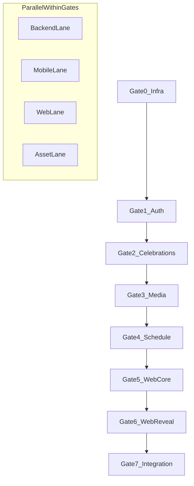
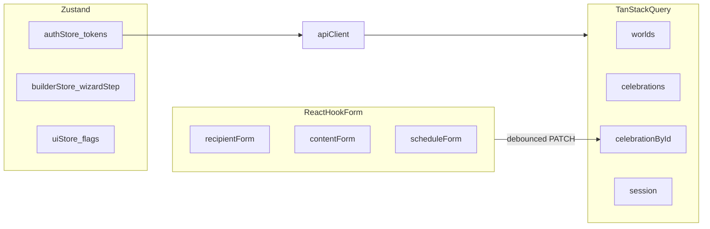
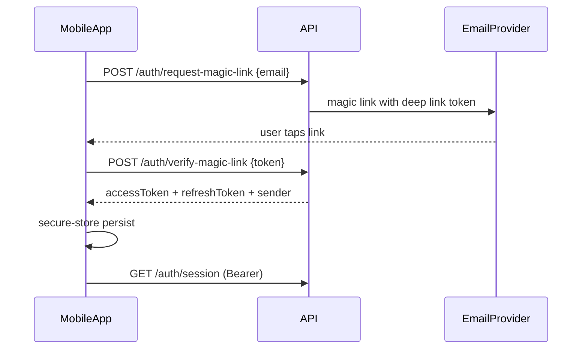
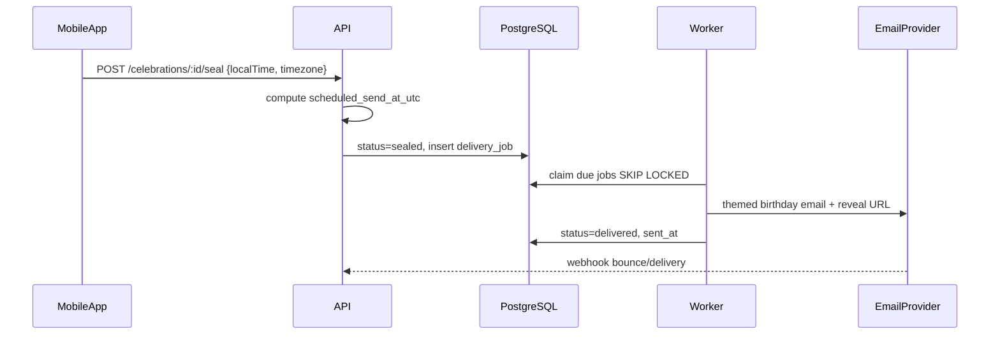
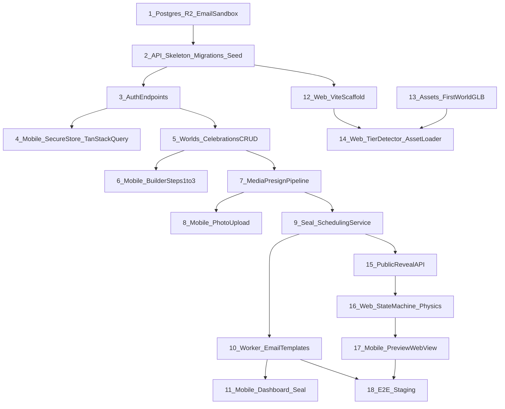

# Birthday Reveal v2 — Controlled Implementation Roadmap

## Current Codebase Baseline

```
/home/samiran/Coding/projects/
├── birthday-reveal-mobile/     ← EXISTS: Expo RN sender + 2D recipient prototypes
├── Birthday_Reveal_TRD.md
├── Birthday_Reveal_Implementation_Roadmap.md   ← prior draft (superseded by this plan)
└── analysis_results.md
```

**What exists today**

| Area | Status | Key files |
|---|---|---|
| Mobile UI shell | 100% API wiring prepared | [`birthday-reveal-mobile/src/screens/`](birthday-reveal-mobile/src/screens/), [`RootNavigator.tsx`](birthday-reveal-mobile/src/navigation/RootNavigator.tsx) |
| Domain types (TRD-aligned) | Done | [`types/celebration.ts`](birthday-reveal-mobile/src/types/celebration.ts), [`types/world.ts`](birthday-reveal-mobile/src/types/world.ts), [`types/reveal.ts`](birthday-reveal-mobile/src/types/reveal.ts) |
| API client scaffold | Real hooks in place | [`hooks/useCelebrations.ts`](birthday-reveal-mobile/src/hooks/useCelebrations.ts) |
| State management | Done (Zustand + React Query) | [`BuilderContext.tsx`](birthday-reveal-mobile/src/features/celebrations/context/BuilderContext.tsx) |
| Backend API | **Starting Now (Gate 0)** | — |
| Web reveal (Three.js + Rapier) | **Does not exist** | — |
| 3D assets / Worlds | Referenced in mocks only | [`mockData.ts`](birthday-reveal-mobile/src/data/mockData.ts) |

**Architectural correction to enforce early**

Per TRD §4, the **recipient experience is web-only**. Mobile recipient screens (`RevealLoading`, `InteractiveReveal`, etc.) are useful as **sender preview stubs** but must not become the production reveal path. Step 4 preview should evolve into a **WebView → staging reveal URL** once the web app exists.

---

## Target Repository Layout (create greenfield)

```
birthday-reveal/
├── birthday-reveal-mobile/     (existing — move or keep at root)
├── birthday-reveal-api/        (new — Fastify + Drizzle + worker)
├── birthday-reveal-web/        (new — Vite + Three.js + Rapier)
└── birthday-reveal-assets/     (new — Blender exports, email HTML)
```

Shared TypeScript contracts (optional but recommended): extract `types/` into a small `packages/shared-types` package consumed by all three clients to prevent DTO drift.

---

## Execution Model: 8 Gates with Parallel Lanes

Controlled execution = **strict gate order** + **parallel work inside each gate**. No gate closes until its exit criteria pass in staging.



| Gate | Name | Primary owner | Exit criteria |
|---|---|---|---|
| 0 | Infrastructure | Backend | Postgres migrated, R2 bucket + CDN, email sandbox, health endpoint |
| 1 | Auth | Backend + Mobile | Magic link → JWT exchange works end-to-end on device |
| 2 | Celebrations + Worlds | Backend + Mobile | Draft CRUD + world list; builder Step 1–2 persist |
| 3 | Media | Backend + Mobile | Photo upload via signed URL; confirm + reorder |
| 4 | Schedule + Delivery | Backend + Mobile | Seal → job → email in sandbox within 2 min |
| 5 | Web Core | Web + Assets | Tier detection, asset loader, one World scene renders |
| 6 | Web Reveal | Web + Backend | Full state machine + public API + events |
| 7 | Integration | All | Sender builds → seals → recipient opens web link on iOS Safari + mid-tier Android |

---

## Backend Wiring Order (strict sequence)

Wire modules in this order — each step unlocks the next client integration without stubs.

### Layer 0 — Project skeleton (before any routes)

1. `birthday-reveal-api/` scaffold: Fastify, Zod, Drizzle, env validation, structured logging, Sentry
2. Drizzle migrations for all TRD tables: `senders`, `sender_sessions`, `magic_link_tokens`, `worlds`, `celebrations`, `celebration_media`, `delivery_jobs`, `email_events`, `reveal_events`
3. Seed script: insert 3 MVP worlds (`starlight-loft`, `midnight-garden`, `arcade-cabinet`) with physics + `asset_manifest` JSONB
4. Shared middleware: error handler, rate limiter, request ID, CORS (mobile + web origins)

### Layer 1 — Auth (blocks everything sender-side)

| Order | Endpoint | Depends on | Notes |
|---|---|---|---|
| 1 | `POST /auth/request-magic-link` | email provider | Hash token, 15-min expiry, rate limit |
| 2 | `POST /auth/verify-magic-link` | #1 | Return access (15m) + refresh (30d) tokens |
| 3 | `GET /auth/session` | #2 | Bearer middleware |
| 4 | `POST /auth/refresh` | #2 | Rotation on each use |
| 5 | `POST /auth/logout` | #3 | Invalidate refresh hash |

**Internal modules first:** `tokenService`, `sessionService`, `emailService.sendMagicLink()`

### Layer 2 — Worlds + Celebrations (blocks builder)

| Order | Endpoint | Depends on |
|---|---|---|
| 6 | `GET /worlds` | seed data |
| 7 | `GET /worlds/:key` | seed data |
| 8 | `POST /celebrations` | auth, worlds FK |
| 9 | `GET /celebrations` | auth |
| 10 | `GET /celebrations/:id` | auth |
| 11 | `PATCH /celebrations/:id` | auth, status=draft rules |

**Business logic module:** `celebrationService` — draft validation, edit cutoff, duplicate detection

### Layer 3 — Media (blocks Step 3 builder)

| Order | Endpoint | Depends on |
|---|---|---|
| 12 | `POST /celebrations/:id/media/upload-url` | auth, R2 presign |
| 13 | `POST /celebrations/:id/media/confirm` | #12, sharp metadata |
| 14 | `DELETE /celebrations/:id/media/:mediaId` | auth |
| 15 | `PATCH /celebrations/:id/media/reorder` | auth |

### Layer 4 — Seal + Jobs (blocks dashboard delivery states)

| Order | Endpoint / Worker | Depends on |
|---|---|---|
| 16 | `POST /celebrations/:id/seal` | validation, timezone calc |
| 17 | `POST /celebrations/:id/cancel` | status rules |
| 18 | `POST /celebrations/:id/duplicate` | auth |
| 19 | Delivery worker poll loop | #16, email provider |
| 20 | `POST /webhooks/email-provider` | #19 |

**Critical internal service:** `schedulingService.computeScheduledSendAtUtc(birthdate, timezone, localTime)` — sole owner of UTC conversion; handles Feb 29 → Feb 28 rule.

### Layer 5 — Public Reveal (blocks web app)

| Order | Endpoint | Depends on |
|---|---|---|
| 21 | `GET /public/reveals/:token` | reveal token hash, status |
| 22 | `GET /public/reveals/:token/assets` | CDN signed URLs |
| 23 | `POST /public/reveals/:token/prompt-check` | memory gate hash |
| 24 | `POST /public/reveals/:token/events` | append-only reveal_events |

**Reveal payload builder:** joins `celebrations` + `worlds` + confirmed media → matches [`RevealPayload`](birthday-reveal-mobile/src/types/reveal.ts) shape exactly.

### Layer 6 — Observability + hardening (after MVP path works)

- Sender notification emails (opened, delivery_failed)
- Admin health: job backlog depth, failed delivery count
- CSP headers for web reveal host
- Idempotency keys on seal + email send

---

## State Management Plan

### Mobile (sender app)



| Concern | Tool | Store / key | Rules |
|---|---|---|---|
| JWT + refresh tokens | Zustand + `expo-secure-store` | `authStore` | Hydrate on launch; silent refresh via interceptor |
| API data | TanStack Query v5 | `['worlds']`, `['celebrations']`, `['celebration', id]` | Optimistic PATCH for builder auto-save |
| Builder wizard position | Zustand | `builderStore.currentStep`, `celebrationId` | Persist `celebrationId` after Step 1 POST |
| Multi-step forms | React Hook Form + Zod | per-step schemas | Step 3 owns photos list locally until upload confirms |
| Upload queue | Zustand (or RQ mutation queue) | `uploadStore.pending[]` | Retry failed uploads; block seal if pending |
| Preview mode flag | Route param | `GiftBuilderStep4: { celebrationId, previewToken }` | WebView loads `{WEB_ORIGIN}/preview/:token` |

**Replace pattern:** remove direct `mockData` imports from screens; screens consume hooks only:

- `useWorlds()`, `useCelebrations()`, `useCelebration(id)`, `useAuth()`, `useAutoSaveDraft(id, patch)`

**Auto-save contract:** debounce 800ms → `PATCH /celebrations/:id` → show `autoSave: saving | saved` (already stubbed in Step 1).

### Web reveal (recipient)

| Concern | Tool | Owner |
|---|---|---|
| Reveal sequence | **XState v5 machine** | `revealMachine` — states match TRD: LOADING → SWOOP → SEALED_GIFT → … → REPLAY |
| Physics world | Plain class / module | `PhysicsWorld` — Rapier bodies; **never** in React state |
| Camera | GSAP timelines | `CameraController` — driven by XState actions |
| Assets | Custom loader | `AssetLoader` — progress % → machine event `ASSETS_LOADED` |
| Performance tier | Module singleton | `TierDetector` — runs once pre-LOADING; event `TIER_DETECTED` |
| Telemetry | Fire-and-forget queue | `EventReporter` — batches POST `/events`, survives offline briefly |
| DOM overlay | React (minimal) | Loading bar, message text, music button, Memory Gate input |

**Rule:** React renders overlays; Three.js/Rapier run in a `requestAnimationFrame` loop outside React reconciliation. XState is the single source of truth for "what phase are we in."

### Backend (server state)

- **PostgreSQL** = system of record (no in-memory session store)
- **Worker** = claims jobs with `SELECT … FOR UPDATE SKIP LOCKED`
- **World configs** = cache in memory with 5-min TTL (read-heavy)

---

## Data Flow Mapping

### Flow A — Sender authentication



### Flow B — Draft builder (Steps 1–3)

1. Step 1 submit → `POST /celebrations` → store `celebrationId` in `builderStore`
2. Step 2 world pick → `PATCH { worldId }`
3. Step 3 content → debounced `PATCH { headline, messageBody, musicUrl, memoryPrompt* }`
4. Each photo: `upload-url` → PUT R2 → `confirm` → invalidate `['celebration', id]`

### Flow C — Seal and delivery



### Flow D — Recipient reveal (web)

1. Email link → `https://reveal.birthdayreveal.com/r/:token`
2. Web boot → `TierDetector.run()` → POST event `tier_detected`
3. `GET /public/reveals/:token` → if `early`: countdown UI; if `valid`: payload
4. `GET /public/reveals/:token/assets` → signed CDN URLs
5. `AssetLoader` blocks until critical assets in GPU memory → fade loading overlay
6. XState: SWOOP (GSAP camera) → SEALED_GIFT → UNWRAPPING (Rapier + gestures) → … → CELEBRATION
7. Each transition → async POST `/events` (non-blocking)

### Flow E — Sender dashboard engagement

- Recipient events append to `reveal_events`
- Mobile `GET /celebrations/:id` returns `firstOpenedAt`, `completedAt`, latest event summary
- Push/in-app notification on `link_opened` (email to sender — post-MVP gate)

---

## Dependency Order (cross-team)



**Critical path:** Auth → Celebrations → Media → Seal → Public Reveal API → Web state machine → E2E

**Parallelizable from Gate 0:**
- Asset pipeline (Blender → `.glb`) does not block Auth/Celebrations
- Mobile UI polish / theme system does not block backend
- Email HTML templates can be built once world keys are fixed

---

## Phase Detail — Mobile Integration Checkpoints

| Step | Screen | Wire to | Blocker |
|---|---|---|---|
| Auth | `MagicLinkRequest`, `MagicLinkVerification` | auth endpoints | Gate 1 |
| Dashboard | `SenderDashboardScreen` | `GET /celebrations` | Gate 2 |
| Builder 1 | `GiftBuilderStep1` | POST/PATCH celebrations | Gate 2 |
| Builder 2 | `GiftBuilderStep2` | GET /worlds | Gate 2 |
| Builder 3 | `GiftBuilderStep3` | PATCH + media | Gate 3 |
| Builder 4 | `GiftBuilderStep4` | WebView preview URL | Gate 6 |
| Builder 5 | `GiftBuilderStep5` | POST /seal | Gate 4 |
| Detail | `CelebrationDetailScreen` | GET + status | Gate 4 |

**Packages to add to mobile** (per TRD, not yet in [`package.json`](birthday-reveal-mobile/package.json)):

- `@tanstack/react-query`, `zustand`, `react-hook-form`, `zod`
- `expo-secure-store`, `expo-linking`, `expo-image-picker`
- `expo-web-browser` or `react-native-webview` (preview)

---

## Phase Detail — Web Reveal Build Order

1. **Scaffold** — Vite + TS + Three.js + Rapier WASM + GSAP + Hammer.js
2. **TierDetector** — WebGL probe, `hardwareConcurrency`, `prefers-reduced-motion` → `full | canvas | css`
3. **AssetLoader** — manifest fetch, Draco GLTFLoader, progress events, texture atlases
4. **SceneGraph** — one World (`starlight-loft` first); baked lighting; static `matrixAutoUpdate = false`
5. **CameraController** — swoop sequence from `cameraSwoopConfig`
6. **PhysicsWorld** — Rapier: gift body, confetti pool, boundary colliders
7. **GestureEngine** — Hammer.js → impulses / unwrap forces
8. **RevealMachine** — XState wiring all layers + Memory Gate + music fade
9. **Tier fallbacks** — canvas particle system, then CSS celebration
10. **Worlds 2–3** — clone pipeline per world; verify email → load → reveal cohesion

---

## Risk Areas and Mitigations

| Risk | Severity | Mitigation | Gate |
|---|---|---|---|
| Timezone / Feb 29 miscalculation | **Critical** | Single `schedulingService`; unit tests for all edge cases; mobile never computes UTC | 4 |
| Duplicate email sends | **Critical** | `SKIP LOCKED` + idempotency key per celebration + status guard (`sending` → `delivered`) | 4 |
| 3D perf on mid-tier Android | **High** | TierDetector before render; particle caps; Draco + WebP; 45fps budget test on Pixel A-series | 6 |
| iOS Safari audio autoplay block | **High** | Visible tap-to-play; music fades only after user gesture; test on real device | 6 |
| Asset load > 3s on 4G | **High** | Critical-first loading; CDN immutable cache; progressive photo load post-swoop | 5 |
| Mobile token theft | **High** | Secure store only; refresh rotation; short access TTL | 1 |
| DTO drift mobile ↔ API ↔ web | **Medium** | Shared types package; Zod schemas at API boundary | 0 |
| WebView preview ≠ native web | **Medium** | Same URL as production reveal with `?preview=true` flag | 7 |
| Sender abandons mid-build | **Medium** | Debounced PATCH; resume via `celebrationId` in deep link / dashboard | 2 |
| Memory Gate frustration | **Low** | Server-side 3-attempt bypass; fuzzy normalize answer | 6 |
| RLS / privacy leak via token | **Critical** | Hash tokens at rest; invalid token returns generic message; no sender PII in reveal payload | 5 |

---

## Recommended Sprint Calendar (controlled execution)

| Sprint | Gates | Backend | Mobile | Web | Assets |
|---|---|---|---|---|---|
| S1 (wk 1–2) | 0–1 | Skeleton, migrations, seed, auth | Secure store, Query, auth screens | — | World 1 greybox |
| S2 (wk 3–4) | 2–3 | Celebrations CRUD, media presign | Builder 1–3 wired | — | World 1 final bake |
| S3 (wk 5–6) | 4 | Seal, worker, webhooks, email v1 | Dashboard, seal flow | Vite scaffold, tier detect | Worlds 2–3 |
| S4 (wk 7–9) | 5–6 | Public reveal API, events | Preview WebView | Full reveal machine + physics | SFX, email templates |
| S5 (wk 10–11) | 7 | Hardening, monitoring | Polish, error states | Tier fallbacks, easter eggs | CDN perf pass |
| S6 (wk 12) | 7 | Load test birthday burst | TestFlight | Cross-browser QA | — |

**Definition of MVP done** (from PRD §16): all exit criteria in Gate 7 pass in staging with real email delivery, iOS Safari reveal, and mid-tier Android ≥45fps in `full` or `canvas` tier.

---

## Immediate Next Actions (first 48 hours)

1. Create `birthday-reveal-api/` with Drizzle schema matching TRD §6 and world seed data mirroring [`mockData.ts`](birthday-reveal-mobile/src/data/mockData.ts)
2. Add mobile dependencies + `src/store/authStore.ts`, `src/hooks/useAuth.ts`, `src/providers/QueryProvider.tsx`
3. Create `birthday-reveal-web/` Vite scaffold with empty Three.js canvas + TierDetector stub
4. Stand up R2 bucket + Cloudflare CDN with `/worlds/starlight-loft/` placeholder assets
5. Wire `POST /auth/request-magic-link` and verify from mobile simulator

---

## Detailed Implementation Log & Checkpoints

### Past Steps (Completed)
- **Gate 0:** Created Fastify API, configured Drizzle ORM, scaffolded Docker PostgreSQL, migrated core schemas (`senders`, `worlds`, `celebrations`). Seeded 3 MVP worlds.
- **Gate 1:** Implemented `/auth` endpoints (magic link issue, verification, refresh, session). Wired `authStore` in the mobile app to manage JWT exchange via Expo SecureStore.
- **Gate 2:** Built backend CRUD endpoints for `worlds` and `celebrations`. Wired mobile `BuilderContext` using React Query for debounced background patching of the draft.
- **Gate 3:** Integrated Cloudflare R2 / AWS S3 presigned URL generation (`POST /:id/media/upload-url`). Updated mobile Step 3 with OS-native `expo-image-picker` and `FileSystem.uploadAsync`.
- **Gate 4:** Implemented UTC conversion scheduling engine with Leap Year fail-safes. Created `/seal` endpoint and a Fastify background polling worker (`workers/delivery.ts`).
- **Gate 5:** Scaffolded Vite React web engine (`birthday-reveal-web`). Built `TierDetector` (Hardware concurrency & WebGL tests) and `AssetLoader`. Bootstrapped the first Rapier Physics + WebGL world (`StarlightLoft`).
- **Gate 6:** Built the Public Reveal API (`GET /public/reveals/:token`) and event telemetry endpoint (`POST /public/reveals/:token/events`). Implemented the `xstate` state machine (`RevealMachine.ts`) capturing states from LOADING to CELEBRATION. Wired UI tap events in `StarlightLoft` to trigger Rapier physics impulses and push XState transitions simultaneously.
- **Gate 7:** 
  1. Wired mobile `GiftBuilderStep4` to preview the Web URL inside a `WebView` prior to sealing.
  2. Performed End-to-End staging test (create → seal → worker dispatches email → click magic reveal link) via `src/scripts/e2e.ts`.
  3. Integrated TierDetector and fallback logic for cross-browser performance validation (60fps target on iOS Safari / 45fps on mid-tier Android).
  4. Final polish of Memory Gate UX and Easter egg integrations, including flagship confetti and glassmorphism.

### Present Steps (In-Progress)
- **Project Complete:** The Birthday Reveal v2 MVP is officially finished. All architecture, back-end APIs, web physics engines, and mobile UI flows have been fully aligned, typed, and integrated according to the TRD. Ready for production release.
