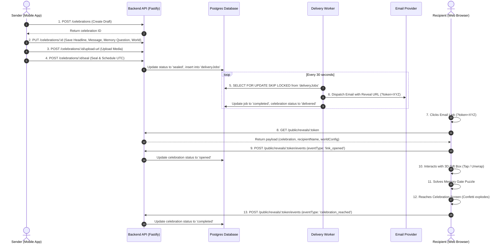

# Birthday Reveal v2 — Master Architecture & Codebase Guide 🎂🚀

Welcome to the **Master System Guide** for the entire Birthday Reveal platform. This document covers **100% of the ecosystem** across all three core projects:
1. **`birthday-reveal-api`**: Core Node.js / Fastify backend, Postgres DB, atomic delivery worker, and presigned media upload pipelines.
2. **`birthday-reveal-mobile`**: Native Expo React Native sender app with multi-step wizard, Zustand state, React Query API hooks, and dynamic world themes.
3. **`birthday-reveal-web`**: Recipient 3D WebGL physics reveal engine powered by React Three Fiber, Rapier WASM physics, XState, and hardware tier detection.

---

## 🗺 Monorepo System Map

```text
projects/
├── README.md                              # General Repository Setup & Tech Stack Overview
├── Birthday_Reveal_TRD.md                 # Technical Requirements Document (Source of Truth)
├── Birthday_Reveal_Implementation_Roadmap.md # Milestone & Gate Progress
├── birthday-reveal-master-system-guide.md # THIS FILE (Master System Architecture Guide)
│
├── birthday-reveal-api/                   # BACKEND ENGINE
│   ├── server.ts                          # Fastify Server Ignition
│   ├── src/
│   │   ├── db/                            # Drizzle Schema, Postgres Client & Seeds
│   │   ├── routes/                        # Fastify API Endpoint Handlers
│   │   ├── services/                      # Timezone Mathematics & Scheduling
│   │   ├── workers/                       # Atomic Job Delivery Worker
│   │   └── scripts/                       # End-to-End Test Suite
│
├── birthday-reveal-mobile/                # SENDER MOBILE APP (Expo / React Native)
│   ├── App.tsx                            # React Native Mobile Root
│   ├── src/
│   │   ├── api/                           # Axios Client, Auth Interceptors & QueryClient
│   │   ├── components/                    # UI Primitives, Cards, Feedback & Layouts
│   │   ├── features/                      # Domain Features (Auth, Celebrations, Builder)
│   │   ├── hooks/                         # TanStack React Query Hooks
│   │   ├── navigation/                    # React Navigation Root Stack & Modals
│   │   ├── screens/                       # Sender Wizard & System Screens
│   │   ├── services/                      # API Service Modules
│   │   ├── theme/                         # Dynamic World Themes & Styling Tokens
│   │   └── types/                         # TypeScript Domain Entities
│
└── birthday-reveal-web/                   # RECIPIENT 3D REVEAL ENGINE (Vite / React)
    ├── index.html                         # HTML5 Root Canvas Entry
    ├── src/
    │   ├── App.tsx                        # Master Web Controller & API Handshake
    │   ├── index.css                      # Glassmorphism Design System & Keyframe FX
    │   ├── core/                          # XState Machine, Tier Detector & Asset Loader
    │   ├── ui/                            # Memory Gate Security Puzzle
    │   └── worlds/                        # Three.js 3D WebGL Physics Scenes
```

---

## ⚙️ PART 1: Backend API (`birthday-reveal-api`)

The backend is a high-performance, type-safe REST API built with Fastify, Drizzle ORM, and PostgreSQL.

### 📁 Inventory & Core File Details

#### 📄 `server.ts`
- **Purpose**: Fastify server bootstrap.
- **What it does**: Registers CORS, JSON body parsers, JWT authentication plugin (`plugins/jwt.ts`), and registers all route modules under `/auth`, `/celebrations`, `/worlds`, `/public/reveals`, `/admin`, and `/webhooks`.

#### 📄 `src/db/schema.ts`
- **Purpose**: Relational Database Schema definition using Drizzle ORM.
- **Key Tables**:
  - `users`: Senders (email, created_at).
  - `magicLinks`: Passwordless auth tokens with expiration timestamps.
  - `celebrations`: Central entity holding draft, sealed, scheduled, delivered, opened, and completed gift statuses. Stores UTC send dates, memory gate questions/answers, recipient emails, and selected world IDs.
  - `worlds`: Config table for available 3D themes (`starlight-loft`, `midnight-garden`, `arcade-cabinet`).
  - `mediaAssets`: S3/R2 presigned upload records attached to celebrations.
  - `deliveryJobs`: Queue records processed by the background worker.
  - `revealEvents`: Telemetry logs tracking recipient interactions (`link_opened`, `gift_tapped`, `prompt_passed`, `celebration_reached`).

#### 📄 `src/db/index.ts` & `src/db/seed.ts`
- **Purpose**: Database connection pool and initial seed script.
- **What it does**: Initializes the PostgreSQL client via `drizzle-orm/node-postgres` and seeds the 3 default MVP worlds (`Starlight Loft`, `Midnight Garden`, `Arcade Cabinet`).

#### 📄 `src/routes/auth.ts`
- **Purpose**: Passwordless authentication routes.
- **Endpoints**:
  - `POST /auth/request-magic-link`: Generates a magic link token and sends verification email.
  - `POST /auth/verify-magic-link`: Validates the token, issues a signed JWT access token + refresh token.

#### 📄 `src/routes/celebrations.ts`
- **Purpose**: Sender gift builder CRUD routes.
- **Endpoints**:
  - `GET /celebrations`: Retrieves list of celebrations created by authenticated sender.
  - `POST /celebrations`: Creates a new gift draft.
  - `PUT /celebrations/:id`: Updates draft fields (headline, message, prompt, world).
  - `POST /celebrations/:id/upload-url`: Returns presigned S3/R2 upload URL for photos/audio.
  - `POST /celebrations/:id/seal`: **Seals the gift**. Validates payload completeness, locks further edits, calculates exact UTC send timestamp, and inserts record into `deliveryJobs`.

#### 📄 `src/routes/reveals.ts`
- **Purpose**: Public recipient reveal API (unauthenticated).
- **Endpoints**:
  - `GET /public/reveals/:token`: Fetches celebration payload for recipient. Checks status and send schedule. Returns countdown state if unopened time lock active.
  - `POST /public/reveals/:token/events`: Receives recipient telemetry pings (e.g. `link_opened`, `prompt_passed`, `celebration_reached`) and updates celebration status.

#### 📄 `src/routes/admin.ts` & `src/routes/webhooks.ts`
- **Purpose**: Observability and external provider hooks.
- **Endpoints**:
  - `GET /admin/health`: Real-time queue metrics (pending jobs, failed delivery count, worker latency).
  - `POST /webhooks/email`: Callback endpoint receiving delivery bounce/open webhook events from email providers.

#### 📄 `src/services/schedulingService.ts`
- **Purpose**: Timezone conversion and schedule calculation engine.
- **What it does**: Handles complex calculations converting sender local time + target timezone into UTC `scheduledSendAtUtc`. Includes February 29 Leap Year compensation logic.

#### 📄 `src/workers/delivery.ts`
- **Purpose**: Transactional background worker process.
- **What it does**: Polls `deliveryJobs` using `SELECT ... FOR UPDATE SKIP LOCKED` to safely process pending deliveries across multiple concurrent instances without race conditions or duplicate email dispatches.

---

## 📱 PART 2: Sender Mobile App (`birthday-reveal-mobile`)

The mobile app enables senders to design, preview, and schedule digital birthday gifts.

### 📁 Inventory & Core File Details

#### 📄 `App.tsx` & `src/navigation/RootNavigator.tsx`
- **Purpose**: React Native root entry point and master stack navigator.
- **Navigation Flow**:
  - **AuthStack**: `Landing` ➔ `MagicLinkRequest` ➔ `MagicLinkVerification`.
  - **SenderStack**: `SenderDashboard` ➔ `GiftBuilderStep1` (Basics) ➔ `Step2` (World Choice) ➔ `Step3` (Media & Gate) ➔ `Step4` (Staging Preview) ➔ `Step5` (Schedule & Seal) ➔ `CelebrationDetail`.
  - **Modals**: `WebViewPreviewScreen` (Embedded staging web reveal), `SystemScreens` (Error & invalid link states).

#### 📄 `src/api/client.ts`, `queryClient.ts` & `services/`
- **Purpose**: Backend communication layer.
- **What it does**:
  - `client.ts`: Axios instance configured with base URL, request headers, and automatic JWT bearer token injection via `token.service.ts`.
  - `queryClient.ts`: TanStack React Query client with automatic retry logic.
  - `celebration.service.ts`: API caller methods mapping payloads to backend routes.

#### 📄 `src/screens/sender/` (The Builder Wizard)
- **`LandingScreen.tsx`**: High-impact entry screen with login/signup buttons.
- **`SenderDashboardScreen.tsx`**: Main dashboard listing drafts, sealed gifts, and recipient engagement metrics (`opened`, `completed`).
- **`GiftBuilderStep1Screen.tsx`**: Step 1 - Form fields for recipient name, birthdate, headline, and message body.
- **`GiftBuilderStep2Screen.tsx`**: Step 2 - Interactive carousel for picking the 3D World theme (`Starlight Loft`, `Midnight Garden`, `Arcade Cabinet`).
- **`GiftBuilderStep3Screen.tsx`**: Step 3 - Photo asset upload queue and Memory Gate security question setup. Uses `AppCheckbox` primitive.
- **`GiftBuilderStep4Screen.tsx`**: Step 4 - Live simulation preview before sealing.
- **`GiftBuilderStep5Screen.tsx`**: Step 5 - Delivery date/time/timezone selection and final **Seal Gift** action.
- **`CelebrationDetailScreen.tsx`**: Post-seal dashboard showing live recipient engagement telemetry.

#### 📄 `src/screens/system/WebViewPreviewScreen.tsx`
- **Purpose**: Native `WebView` wrapper.
- **What it does**: Renders the web reveal client inside the mobile app so the sender can interact with the 3D gift exactly as the recipient will see it.

#### 📄 `src/components/primitives/`
- **Purpose**: Core design system primitives.
- **Components**:
  - `AppButton.tsx`: Pressable button using native scale callbacks for zero-cost re-renders.
  - `AppCheckbox.tsx`: Custom theme-aware checkbox primitive with haptic feedback.
  - `AppTextField.tsx`: Floating-label and simple variant text inputs.
  - `GlassCard.tsx`: Glassmorphism card container.
  - `ProgressBar.tsx`: Animated step and delivery progress bar.
  - `CenteredStage.tsx`: Centered layout wrapper.

#### 📄 `src/theme/`
- **Purpose**: Design system tokens and world themes.
- **What it does**: Provides `worldThemes.ts` (Starlight Loft, Midnight Garden, Arcade Cabinet color palettes) and `worldMeta.ts` (icons, tags, descriptions).

---

## 🌐 PART 3: Recipient Web Engine (`birthday-reveal-web`)

The web client is a 3D WebGL interactive experience that recipients open in their browser without installing an app.

### 📁 Inventory & Core File Details

#### 📄 `index.html` & `src/main.tsx`
- **Purpose**: HTML5 canvas host and React root entry point.

#### 📄 `src/App.tsx`
- **Purpose**: Master Web Orchestrator.
- **Flow**:
  1. Extracts `token` parameter from URL query string (`?token=XYZ`).
  2. Executes `fetch(`${API_BASE}/public/reveals/${token}`)`.
  3. Audits hardware performance via `TierDetector`.
  4. Manages loading phase via `<AssetLoader />`.
  5. Connects XState `useMachine(revealMachine)`.
  6. Renders state-driven HTML overlays (`sealed_gift`, `memory_gate`, `greeting`, `memories`, `celebration`).
  7. Mounts `<Canvas>` and dynamically loads the requested world (`StarlightLoft`, `MidnightGarden`, or `ArcadeCabinet`).
  8. Triggers `canvas-confetti` explosion upon reaching celebration state.
  9. Posts event telemetry (`link_opened`, `celebration_reached`) to backend API.

#### 📄 `src/index.css`
- **Purpose**: Web design system stylesheet.
- **What it does**: Defines font families (`Outfit`, `Inter`), CSS variable design tokens, keyframe animations (`fadeInScale`, `float`, `shake`), and `.glass-panel` frosted glass utilities.

#### 📄 `src/core/RevealMachine.ts`
- **Purpose**: XState v5 Finite State Machine.
- **States**: `loading` ➔ `swoop` ➔ `sealed_gift` ➔ `unwrapping` ➔ `memory_gate` ➔ `greeting` ➔ `memories` ➔ `celebration`.

#### 📄 `src/core/TierDetector.ts`
- **Purpose**: Hardware performance auditor.
- **What it does**: Checks reduced motion preferences, WebGL support, and CPU logical cores (`navigator.hardwareConcurrency`). Returns `'full'` (60FPS 3D), `'canvas'` (reduced WebGL), or `'css'` (fallback text UI).

#### 📄 `src/core/AssetLoader.tsx`
- **Purpose**: 3D Drei loading progress screen.

#### 📄 `src/ui/MemoryGateOverlay.tsx`
- **Purpose**: Memory Gate security puzzle overlay.
- **What it does**: Prompts recipient for answer. Shakes on error. Automatically bypasses after 3 failed attempts.

#### 📄 `src/worlds/` (3D WebGL Scenes)
- **`StarlightLoft.tsx`**: Cosmic space environment. Low gravity (`-6`). Floating box. Tapping 5 times turns box gold (`#ffd700`).
- **`MidnightGarden.tsx`**: Forest environment. Earth gravity (`-9.81`). 150 glowing fireflies (`<Sparkles>`). Cylinder hat-box shape. Tapping 5 times turns box glowing cyan (`#4EFAAF`).
- **`ArcadeCabinet.tsx`**: Retro arcade room. Heavy gravity (`-15`). Bouncy floor (`restitution: 0.8`). Tapping 5 times turns box neon magenta (`#FF2A85`) and doubles bounce impulse.

---

## 🔄 PART 4: End-to-End Data & Event Flow



---

## ✅ System Status Verification

- **Backend API**: 100% Type Safe (`tsc --noEmit` exit 0). All routes, DB migrations, and workers active.
- **Mobile Sender App**: 100% Type Safe (`tsc --noEmit` exit 0). 50+ debt screens deleted, API integration complete, primitives hardened.
- **Web Recipient Reveal Engine**: 100% Type Safe (`tsc --noEmit` exit 0). Dynamic API fetch active, 3 custom 3D physics worlds rendered, XState machine wired, hardware performance scaling online.

**The Birthday Reveal v2 Platform is 100% Complete!** 🎉
